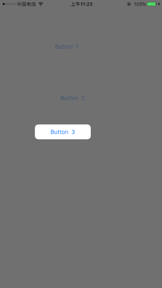
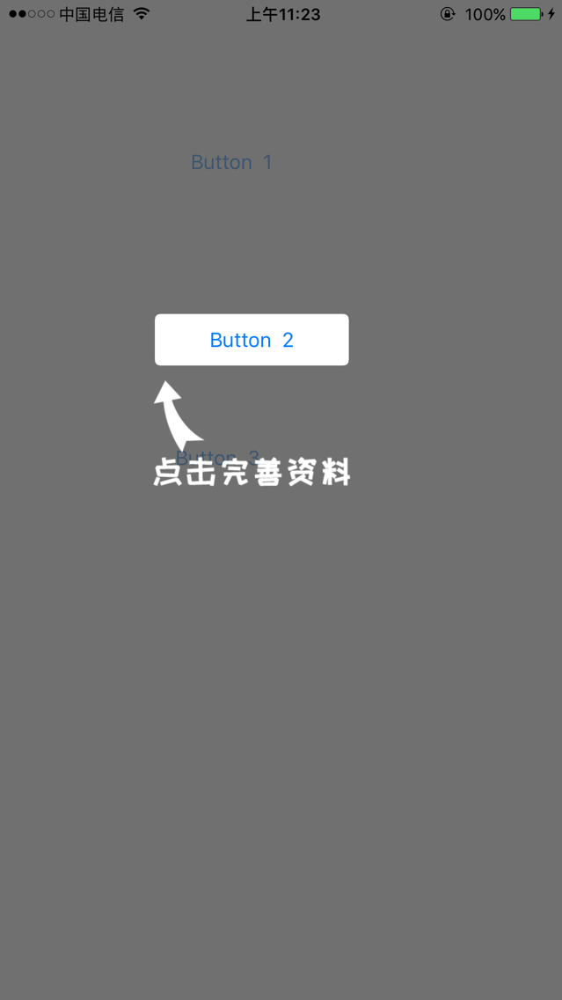

# NewUserGuide


初始化一个 聚光灯效果, 用于功能引导, 支持 path 和 view 的设置,包括一张图片




```
pod 'NewUserGuide'

##
```
    ///新手引导,聚光灯
    -(void)showNewUserGuideIfNeed
    {
    ///先注释,方便查看效果
        //    if([NewUserGuide hadShowNewUserGuideForKey:NSStringFromClass(self.class)] ||
        //       [NewUserGuide isShowingNewUserGuideForKey:NSStringFromClass(self.class)]
        //       ){
        //        return;
        //    }

    UIView *onView ;
    //    = self.tabBarController.navigationController.view;
    onView = [UIApplication sharedApplication].keyWindow;

    UIBezierPath *path = [UIBezierPath bezierPathWithRoundedRect:[self.view convertRect:self.btn2.frame toView:onView] cornerRadius:5];
    UIImage *image = [UIImage imageNamed:@"newUserGuide-1"];

    CGPoint point = [self.view convertPoint:self.btn2.center toView:onView];
    point.y += self.btn2.frame.size.height/2 + 10;
    point.x -= image.size.width /2 ;


    NewUserGuide *view = [[NewUserGuide alloc] init];

    [view showOn:onView path:path appendPath:YES image:image imageAt:point withKey:NSStringFromClass(self.class) afterTap:^{


    [view showOn:onView forView:_btn3 cornerRadius:10 image:nil imageAt:CGPointMake(100, 100) withKey:@"btn3" afterTap:^{

    }];

    }];


    }

`
<br>如果对您有帮助,还请star支持一下
<br>如果对您有帮助,还请star支持一下
<br>

